# DOT Format Complete Reference Guide

Professional guide to Graphviz DOT format for Graph Library.

---

## 📋 Table of Contents

1. [Basic Syntax](#basic-syntax)
2. [Node Attributes](#node-attributes)
3. [Edge Attributes](#edge-attributes)
4. [Graph Attributes](#graph-attributes)
5. [Layout Directions](#layout-directions)
6. [Colors & Styling](#colors--styling)
7. [Subgraphs & Clusters](#subgraphs--clusters)
8. [Examples](#examples)
9. [Graph Library Integration](#graph-library-integration)

---

## Basic Syntax

### Directed Graph
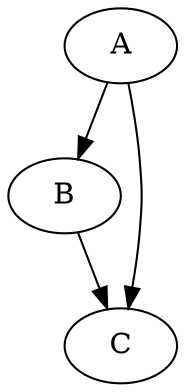

### Undirected Graph
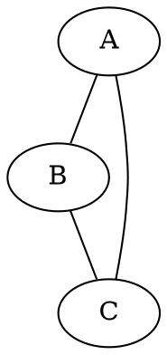

### With Attributes
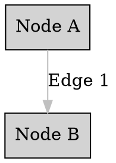

---

## Node Attributes

### Shape
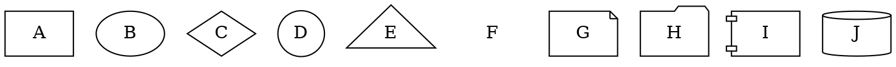

### Styling
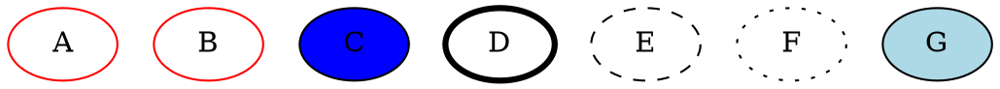

### Labels & Positioning
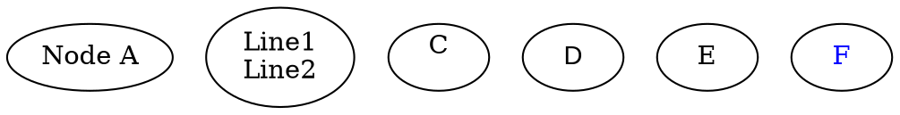

### Size & Position
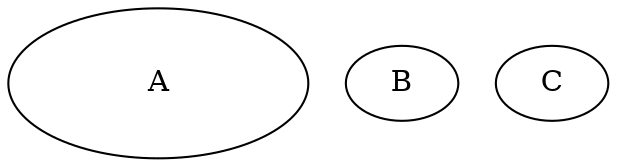

---

## Edge Attributes

### Style
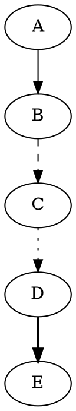

### Arrows
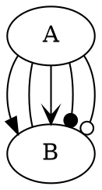

### Labels & Colors
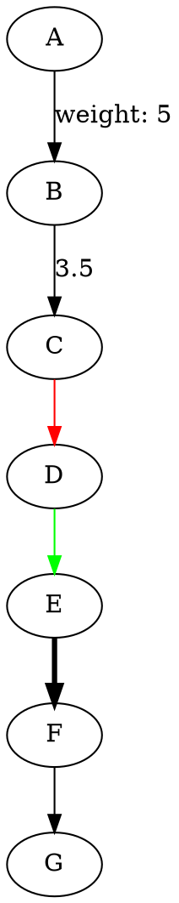

### Weight & Constraint
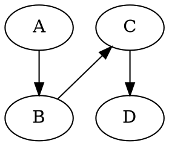

---

## Graph Attributes

### Layout
```dot
digraph G {
    rankdir=LR;             // Direction: TB, LR, BT, RL
    rank=same;              // Same rank level
    nodesep=0.5;            // Node separation
    ranksep=0.5;            // Rank separation
    overlap=false;          // Prevent overlaps
}
```

### Styling


### Labels & Output
```dot
digraph G {
    label="My Graph";       // Graph title
    labelloc=top;          // Title position
    labelfontsize=16;      // Title font size
    caption="Subtitle";    // Additional caption
}
```

---

## Layout Directions

### Top to Bottom (Default)
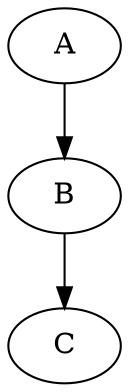
Output: A at top, C at bottom

### Left to Right
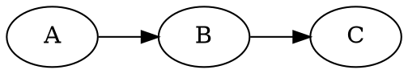
Output: A on left, C on right

### Right to Left
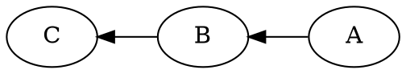
Output: A on right, C on left

### Bottom to Top
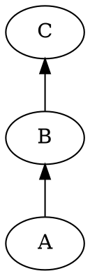
Output: A at bottom, C at top

---

## Colors & Styling

### Standard Colors
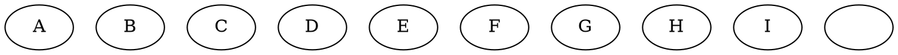

### Hex Colors
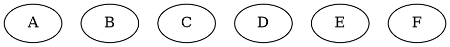

### Light Colors
```dot
digraph {
    A [fillcolor=lightblue];
    B [fillcolor=lightgreen];
    C [fillcolor=lightyellow];
    D [fillcolor=lightgray];
    E [fillcolor=lightcyan];
}
```

### Combined Styling
```dot
digraph {
    node [style=filled, fontcolor=white];
    A [fillcolor=blue, shape=box];
    B [fillcolor=red, shape=circle];
    C [fillcolor=green, shape=diamond];
}
```

---

## Subgraphs & Clusters

### Basic Subgraph
```dot
digraph {
    subgraph cluster_0 {
        label="Cluster 0";
        A; B; C;
        A -> B -> C;
    }
    
    subgraph cluster_1 {
        label="Cluster 1";
        D; E; F;
        D -> E -> F;
    }
    
    C -> D [label="Inter-cluster"];
}
```

### Nested Clusters
```dot
digraph {
    subgraph cluster_main {
        label="Main System";
        
        subgraph cluster_input {
            label="Input";
            I1; I2;
        }
        
        subgraph cluster_output {
            label="Output";
            O1; O2;
        }
    }
}
```

---

## Examples

### Example 1: Simple Network
```dot
digraph network {
    rankdir=LR;
    
    node [shape=box, style=filled, fillcolor=lightblue];
    
    Server1 [label="Web Server"];
    Server2 [label="App Server"];
    Database [label="Database"];
    
    Server1 -> Server2 [label="Request"];
    Server2 -> Database [label="Query"];
    Database -> Server2 [label="Result"];
}
```

### Example 2: State Machine
```dot
digraph FSM {
    rankdir=LR;
    
    node [shape=circle, style=filled, fillcolor=lightblue];
    
    Idle [shape=circle, fillcolor=lightgreen];
    Running [shape=circle, fillcolor=lightyellow];
    Error [shape=circle, fillcolor=lightcoral];
    
    Idle -> Running [label="start"];
    Running -> Error [label="exception"];
    Error -> Idle [label="reset"];
    Running -> Idle [label="stop"];
}
```

### Example 3: Colored Graph
```dot
digraph colored {
    node [style=filled];
    edge [color=gray];
    
    A [fillcolor=red];
    B [fillcolor=blue];
    C [fillcolor=green];
    D [fillcolor=yellow];
    
    A -> B [color=red];
    B -> C [color=blue];
    C -> D [color=green];
    A -> D [color=orange, style=dashed];
}
```

### Example 4: Weighted Graph
```dot
digraph weighted {
    rankdir=LR;
    
    node [shape=box, style=filled, fillcolor=lightblue];
    
    A -> B [label="10", weight=10];
    B -> C [label="5", weight=5];
    A -> C [label="20", weight=20];
    C -> D [label="3", weight=3];
}
```

---

## Graph Library Integration

### Export from Python
```python
from graph_renderer import render_graph

g = Graph(directed=True)
g.add_edge("A", "B", weight=5)
g.add_edge("B", "C", weight=3)

# Get DOT code
dot_code = render_graph(g, format="dot", rankdir="LR")
print(dot_code)

# Save to file
with open("graph.dot", "w") as f:
    f.write(dot_code)
```

### Load into Graph Library
```python
from graph_renderer import GraphRenderer

# Load from DOT file
renderer = GraphRenderer.from_dot_file("graph.dot")
g = renderer.to_graph()
```

### Rendering with Command Line
```bash
# Render to PNG
dot -Tpng graph.dot -o graph.png

# Render to PDF
dot -Tpdf graph.dot -o graph.pdf

# Render to SVG
dot -Tsvg graph.dot -o graph.svg

# Different layouts
neato -Tpng graph.dot -o graph_neato.png
circo -Tpng graph.dot -o graph_circo.png
```

---

## Best Practices

### ✅ Do's
- ✓ Use consistent naming conventions
- ✓ Add meaningful labels
- ✓ Use colors for clarity, not decoration
- ✓ Group related nodes in clusters
- ✓ Use appropriate shapes for different node types
- ✓ Set reasonable rankdir for your data

### ❌ Don'ts
- ✗ Don't use too many colors
- ✗ Don't create overly complex subgraphs
- ✗ Don't use very long labels without line breaks
- ✗ Don't mix different naming styles
- ✗ Don't rely on node positions (let Graphviz layout)

---

## References

- [Official Graphviz Documentation](https://graphviz.org/doc/)
- [DOT Language Reference](https://graphviz.org/doc/info/lang.html)
- [Node/Edge Attributes](https://graphviz.org/doc/info/attrs.html)
- [Color Names](https://graphviz.org/doc/info/colors.html)

---

**Version:** 1.0  
**Last Updated:** June 16, 2025  
**Maintained:** Graph Library Project
